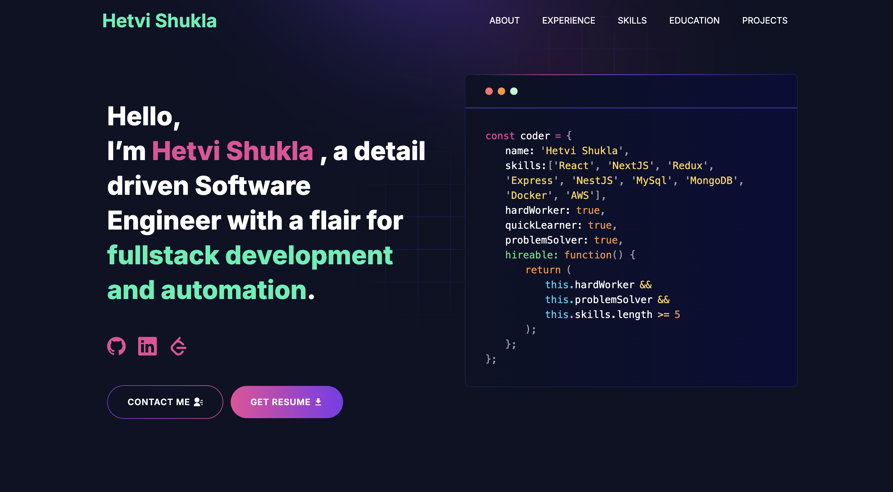

# [Built Portfolio With GitHub](https://github.com/hetvishukla2001/developer-portfolio)

---

# Developer Portfolio

Welcome! 🎉 This personal Developer Portfolio is built with Next.js & Tailwind CSS. It’s super easy to customize and deploy. Let’s get you up and running! 🚀

**Live Demo:** https://hetvi-shukla.vercel.app/

---

## Table of Contents

1. [Sections](#sections)  
2. [Demo](#demo)  
3. [Installation](#installation)  
4. [Getting Started](#getting-started)  
5. [Usage](#usage)  
6. [Deployment](#deployment)  
7. [Tutorials](#tutorials)  
   - [Gmail App Password Setup](#gmail-app-password-setup)  
8. [Packages Used](#packages-used)  
9. [FAQ](#faq)  
10. [Project Structure](#project-structure)  

---

## Sections

- Hero  
- About Me  
- Experience  
- Skills  
- Projects  
- Education  
- Contacts  

---

## Demo



Check it out live: https://hetvi-shukla.vercel.app/

---

## Installation

You’ll need Git & Node.js (v16+):

- Git: https://git-scm.com/downloads  
- Node.js: https://nodejs.org/en/download/  

Verify:

```bash
git --version
node --version
```

---

## Getting Started

1. **Fork & Clone**  
   ```bash
   git clone https://github.com/hetvishukla2001/developer-portfolio.git
   cd developer-portfolio
   ```
2. **Install**  
   ```bash
   npm install
   # or
   yarn install
   ```
3. **Run Dev Server**  
   ```bash
   npm run dev
   # or
   yarn dev
   ```
4. Open [http://localhost:3000](http://localhost:3000) in your browser.

---

## Usage

1. Copy `.env.example` to `.env.local`.  
2. Fill in your environment variables:

   ```env
   NEXT_PUBLIC_GTM=
   NEXT_PUBLIC_APP_URL=
   GMAIL_PASSKEY=
   EMAIL_ADDRESS=
   ```

3. Update `src/utils/data.js` with your personal info (name, profile, designation, description, links, etc.).

---

## Deployment 🚀

Deploy on Vercel in minutes:

1. **Push** your code to GitHub.  
2. **Import** the repo in Vercel:  
   - Sign in at https://vercel.com → **New Project** → select your repo.  
3. **Environment Variables**  
   Under **Settings → Environment Variables**, add:
   ```
   NEXT_PUBLIC_GTM=
   GMAIL_PASSKEY=
   EMAIL_ADDRESS=
   ```
4. **Build & Output Settings** (auto-detected for Next.js):  
   - Install Command: `npm install`  
   - Build Command: `npm run build`  
   - Output Directory: `.next`  
5. **Custom Domain** (optional):  
   - Add in **Settings → Domains** and configure DNS.  
6. **Preview & Production**  
   - Push to any branch → **Preview Deployment**.  
   - Merge to `main` → **Production Deployment**.  
7. **Manual Redeploy**  
   - In Vercel dashboard → **Deployments** → click **Redeploy** on a deployment.

---

## Tutorials 🔧

### Gmail App Password Setup

1. Visit https://myaccount.google.com → **Security**.  
2. Enable **2-Step Verification**.  
3. Under **App passwords**, choose **Mail** + **Other (Custom name)** → **Generate**.  
4. Copy the 16-character password into `GMAIL_PASSKEY` in your `.env.local`.

---

## Packages Used 📦

- @emailjs/browser  
- @next/third-parties  
- axios  
- lottie-react  
- next  
- nodemailer  
- react & react-dom  
- react-fast-marquee  
- react-google-recaptcha  
- react-icons  
- react-toastify  
- sharp  
- sass  
- tailwindcss  

---

## FAQ

**Q: `next` not recognized?**  
**A:** Run `npm install -g next`.

**Q: Update env vars on Vercel?**  
**A:** Dashboard → Settings → Environment Variables → edit → Redeploy.

**Q: View build logs on Vercel?**  
**A:** Project → Deployments → Logs.

---

## Project Structure 📁

```
developer-portfolio/
├── .github/
├── .next/
├── app/
│   ├── api/
│   │   ├── contact/
│   │   ├── data/
│   │   └── google/
│   ├── assets/
│   ├── components/
│   │   ├── helper/
│   │   ├── homepage/
│   │   ├── footer.jsx
│   │   └── navbar.jsx
│   ├── css/
│   ├── favicon.ico
│   ├── layout.js
│   ├── not-found.jsx
│   └── page.js
├── node_modules/
├── public/
│   └── image/
│       └── screen.png
├── utils/
├── .eslintrc.json
├── .gitignore
├── jsconfig.json
├── next.config.js
├── package-lock.json
└── package.json
```

Happy coding! 😊
